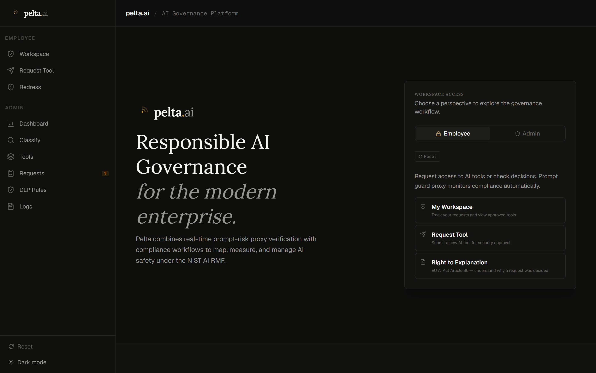
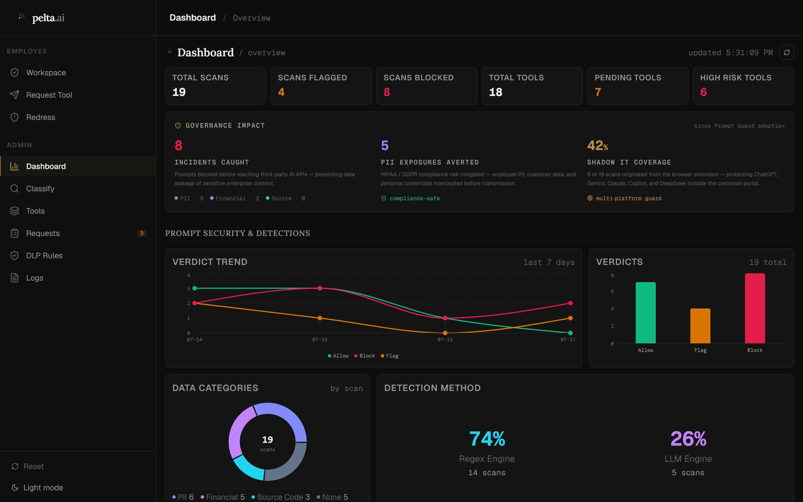
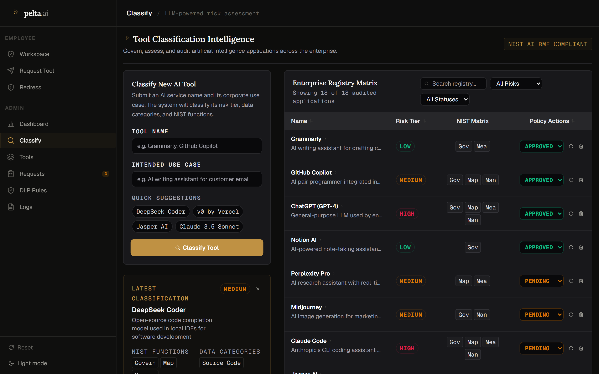
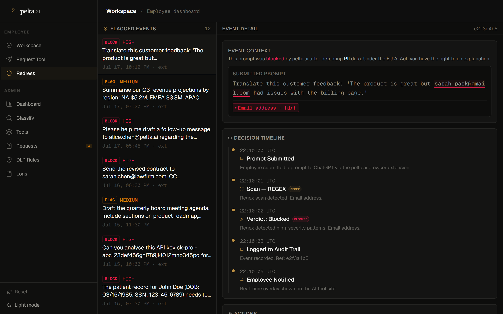
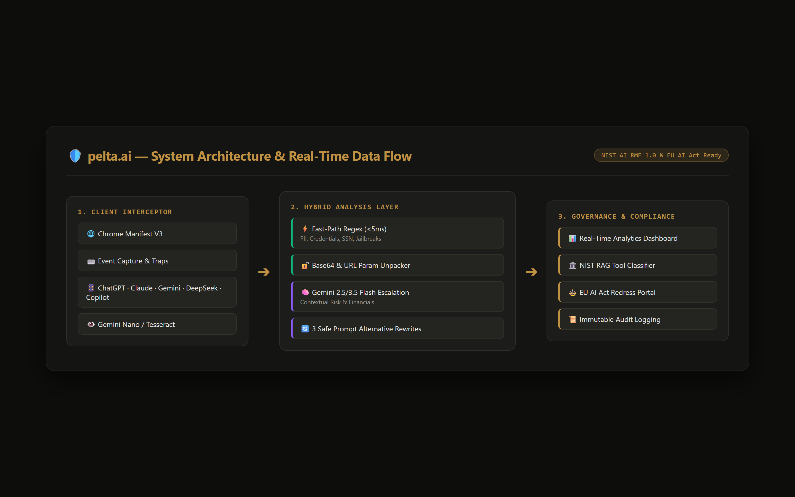

# pelta.ai — Real-Time AI Governance & Prompt DLP

<div align="center">


### *Governing every prompt. Protecting every secret. Empowering every employee.*

[](https://github.com/tanchinqian/pelta.ai)
[](https://github.com/tanchinqian/pelta.ai)
[](https://nextjs.org/)
[](https://www.typescriptlang.org/)
[](https://tailwindcss.com/)
[](https://aistudio.google.com/)
[](https://developer.chrome.com/docs/extensions/mv3/)

</div>

---

## 📌 Executive Overview

**Pelta.ai** is an enterprise-grade AI governance and prompt Data Loss Prevention (DLP) platform built for the modern generative AI era. Operating as an inline proxy and Chrome Manifest V3 interceptor, Pelta inspects, redacts, and governs prompts, pasted screenshots, and uploaded documents before they ever reach external LLM providers (ChatGPT, Google Gemini, Anthropic Claude, DeepSeek, and Microsoft Copilot).

Grounding enterprise security in the **NIST AI Risk Management Framework (AI RMF 1.0)** and guaranteeing compliance with the **EU AI Act (Article 86 Right to Explanation)**, Pelta replaces draconian IT bans with **Governed Freedom**—allowing organizations to harness frontier AI velocity without leaking PII, source code, financial telemetry, or corporate trade secrets.

---

## ⚡ The Problem: Shadow AI vs. Binary IT Bans

| 🚨 The Shadow AI Dilemma (68%) | 💸 Average AI Breach Cost ($4.88M) |
|:---|:---|
| **68% of enterprise employees** acknowledge pasting confidential company data (proprietary source code, customer PII, salary bands, or financial projections) into consumer AI tools. | According to the IBM Cost of a Data Breach Report [1], AI-related data leaks incur a **$670K cost premium** due to delayed discovery and lack of visibility. |

### The Flaw of Binary IT Bans
Traditional security measures (firewalls, legacy CASBs, and DNS blocks) attempt to solve this with blanket tool bans. However, **binary bans invariably fail**:
1. **Productivity Paralysis:** Employees lose access to 40%+ efficiency gains in coding, research, and drafting.
2. **Underground Shadow AI:** Workers bypass VPNs and use personal devices, destroying security visibility.
3. **Context Blindness:** Legacy network DLP cannot parse conversational prompts, base64-encoded strings, or prompt injection payloads.

### The Pelta Solution: Governed Freedom
Pelta.ai changes the paradigm from **restriction** to **intelligent real-time facilitation**. Instead of dropping connections, Pelta sits directly at the client interaction layer, providing **sub-5ms zero-latency regex redaction**, contextual **Gemini LLM escalation**, and **3 instant, safe prompt alternatives** so employees never lose their train of thought.

---

## 🏆 Key Differentiators & Feature Breakdown

| Feature | Core Engine | Technical Capability |
|:---|:---|:---|
| **🛡️ Dual-Engine Guard** | Sub-5ms Regex + Gemini LLM | Real-time high-entropy secret detection and contextual semantic escalation |
| **🔄 Smart Prompt Rewrite** | Gemini Flash Assistant | 3 safe, context-aware alternative prompts (Entity-masked, Abstracted, Simulated) |
| **👁️ Multimodal OCR DLP** | Gemini Nano & Gemini Vision | Screenshot clipboard interception and client-side PDF document scanning |
| **🏛️ NIST AI RMF 1.0** | Automated Keyword RAG | Continuous mapping across Govern, Map, Measure, Manage functions |
| **⚖️ EU AI Act Article 86** | Explainability Portal | Transparent right-to-explanation and human-in-the-loop dispute redress |
| **🌐 Multi-LLM Native** | Manifest V3 Extension | Zero-config DOM interception for ChatGPT, Gemini, Claude, DeepSeek, Copilot |

### 1. 🛡️ Dual-Engine Hybrid Prompt Guard
- **Fast-Path Heuristic Scanner (<5ms):** High-entropy regex patterns catch email addresses, credit cards, SSNs, AWS/Stripe/OpenAI API keys, JWT tokens, and known prompt injection/jailbreak signatures (`DAN`, `ignore previous instructions`).
- **Base64 & URL Parameter Unpacker:** Automatically decodes obfuscated base64 payload strings and extracts URL query parameters before scanning.
- **Custom Enterprise DLP Rules Engine:** Admins can define custom regex rules with live pattern testing, severity levels, and category tagging.
- **Contextual Gemini LLM Escalation:** Inconclusive, nuanced text (e.g., proprietary financial metrics, unreleased roadmap discussions) escalates to Google Gemini for structured semantic risk evaluation.

### 2. 🔄 Smart Prompt Rephrasing (Zero Workflow Friction)
When a prompt is blocked or flagged, Pelta does not simply show an error. It immediately calls Gemini to generate **3 context-preserving safe alternatives**:
1. **Entity Masked:** Replaces names, emails, and credentials with synthetic placeholders (`[Client_A]`, `[REDACTED_KEY]`).
2. **Abstracted / Structural:** Rewrites the prompt to ask for general logic, algorithms, or architecture without confidential internal data.
3. **Simulated Scenario:** Formulates a mock case study achieving the identical technical answer.

### 3. 👁️ Multimodal OCR & Document Interception
- **Clipboard Screenshot Inspection:** Intercepts pasted images in real time using client-side **Gemini Nano** (Chrome Built-in Prompt API) with fallback to **Tesseract.js WASM** and server-side **Gemini Vision OCR**.
- **Document DLP (PDF Extraction):** Scans uploaded PDFs via `pdfjs-dist` to prevent multi-page confidential document leaks.

### 4. 🏛️ NIST AI RMF 1.0 Grounding & Tool Classifier
- Interactive risk classifier (`/admin/tools/new`) utilizing a **keyword RAG pipeline** across the NIST AI RMF Playbook (1,000+ framework actions).
- Automatically assigns risk tiers (**Low / Medium / High**), maps implicated NIST core functions (**Govern, Map, Measure, Manage**), identifies exposed data categories, and drafts actionable access policies.

### 5. ⚖️ EU AI Act Article 86 Redress & Auditability
- **Right-to-Explanation:** Employees can inspect the exact technical reason, matching spans, and policy rules for any flagged prompt or blocked tool at `/employee/redress`.
- **Human-in-the-Loop Appeals:** One-click dispute submission triggers real-time admin review desks and fires Chrome desktop notifications upon admin verdict.
- **Immutable Audit Trail:** All administrative decisions (approvals, rejections, overrides) are logged with mandatory audit rationale.

### 6. 🌐 Multi-LLM Native Extension (Manifest V3)
Native, zero-configuration content scripts seamlessly intercept user submissions across all top frontier models:
- **OpenAI ChatGPT** (`chatgpt.com`, `chat.openai.com`)
- **Google Gemini** (`gemini.google.com`)
- **Anthropic Claude** (`claude.ai`)
- **DeepSeek** (`chat.deepseek.com`)
- **Microsoft Copilot** (`copilot.microsoft.com`)

---

## 📸 UI & Architecture Showcase

### 1. Real-Time Prompt Interception & Safe Rewrite Modal

*Inline DOM modal intercepting a flagged prompt containing credentials and PII, providing 3 context-aware safe rewrites.*

---

### 2. Admin Governance Dashboard

*Real-time analytics showcasing verdict distributions, 82% Regex vs. 18% LLM detection breakdown, department risk heatmaps, and tool registry.*

---

### 3. NIST-Grounded Tool Classifier (RAG Engine)

*Automated risk profiling engine mapping third-party tools to NIST AI RMF core functions and generating corporate access policies.*

---

### 4. EU AI Act Article 86 Redress & Dispute Portal

*Employee workspace for reviewing flagged incidents, understanding automated decisions, and submitting human-in-the-loop appeals.*

---

### 5. 3-Layer System Architecture

*End-to-end data flow showing event interception, dual-engine risk analysis, and governance persistence.*

---

## 🏗️ System Architecture & Data Flow

```
====================================================================================================
                                   PELTA.AI RUNTIME ARCHITECTURE
====================================================================================================

 [ 1. CLIENT LAYER: Multi-LLM Browser Extension (Manifest V3) ]
  ChatGPT │ Google Gemini │ Anthropic Claude │ DeepSeek │ Microsoft Copilot
     │
     ├── 1. User inputs prompt / pastes image / uploads PDF
     ├── 2. Content Script intercepts DOM submit event (Keyboard & Click traps)
     └── 3. Dispatches payload to Background Service Worker via chrome.runtime
            │
            ▼
 [ 2. ANALYSIS LAYER: Next.js 16 Hybrid DLP & Vision Engine ]
  POST /api/guard/check  │  POST /api/guard/ocr  │  POST /api/guard/pdf-extract
     │
     ├── [Step 2.1] Fast-Path Heuristic Scanner (<5ms)
     │     ├── Base64 Obfuscation Decoder & URL Param Extractor
     │     ├── Built-in High-Entropy Regex (PII, SSN, API Keys, JWT, Jailbreaks)
     │     └── Custom Organization DLP Rules (/api/dlp-rules)
     │
     ├── [Step 2.2] Heuristic Evaluation
     │     ├── Verdict: CLEAR ───────► Return "allow" ──► Native send resumed
     │     ├── Verdict: HIGH RISK ───► Return "block" ──► Render Modal + Redress
     │     └── Verdict: SUSPICIOUS ──► [Step 2.3] Escalation to Gemini LLM
     │
     ├── [Step 2.3] Gemini 2.5/3.5 Flash Semantic Inspection
     │     ├── Contextual Risk Assessment (Financial telemetry, M&A secrets)
     │     └── Generates 3 Context-Preserving Safe Alternative Rewrites
     │
     └── [Step 2.4] Audit Log Stream (data/logs.json)
            │
            ▼
 [ 3. GOVERNANCE & COMPLIANCE LAYER: Web Platform & Admin Desks ]
     ├── /admin/dashboard   ──► Real-time telemetry, Recharts risk & verdict trends
     ├── /admin/tools/new   ──► NIST AI RMF Keyword RAG Tool Classifier
     ├── /admin/requests    ──► Unified Redress (EU AI Act) & Tool Access Approvals
     ├── /admin/dlp-rules   ──► Custom Regex pattern builder with live simulator
     └── /employee/redress  ──► Article 86 Right-to-Explanation dispute desk
```

---

## 🚀 Getting Started & Installation

### Prerequisites
- **Node.js:** `v18.18.0` or higher (`v20+` recommended)
- **npm:** `v9+`
- **Browser:** Google Chrome, Brave, Edge, or any Chromium Manifest V3 browser
- **Gemini API Key:** Free key from [Google AI Studio](https://aistudio.google.com/)

---

### Step 1: Clone & Install Dependencies

```bash
git clone https://github.com/tanchinqian/pelta.ai.git
cd pelta.ai
npm install
```

---

### Step 2: Configure Environment Variables

Copy the example environment template and provide your Gemini API key:

```bash
cp .env.example .env.local
```

Edit `.env.local`:
```env
GEMINI_API_KEY=your_google_gemini_api_key_here
```

*(Note: If no API key is provided, the platform automatically engages deterministic fallback classifiers, allowing full UI exploration.)*

---

### Step 3: Run the Development Server

```bash
npm run dev
```

Open [http://localhost:3000](http://localhost:3000) in your browser.

---

### Step 4: Load the Chrome Browser Extension

1. Open Google Chrome and navigate to `chrome://extensions/`.
2. Toggle **Developer mode** in the top-right corner.
3. Click **Load unpacked** in the top-left corner.
4. Select the `extension/` directory inside this repository.
5. *(Optional)* Click extension **Options** to toggle the target API URL between `http://localhost:3000` and production.
6. Navigate to [chatgpt.com](https://chatgpt.com), [gemini.google.com](https://gemini.google.com), or [claude.ai](https://claude.ai) and test typing a prompt with sensitive data (e.g., `sk-1234567890abcdef1234567890abcdef` or `test@company.com`).

---

## 🗺️ Application Routes & API Reference

### Web Platform Pages

| Route | Role | Description |
|-------|------|-------------|
| `/` | Public | Interactive Landing Page, Brand Philosophy, and Live Client-side Sandbox |
| `/admin/dashboard` | Admin | Real-time analytics, verdict trends, NIST function breakdown, detection split |
| `/admin/tools` | Admin | Searchable AI Tool Registry with slide-over editor and policy managers |
| `/admin/tools/new` | Admin | NIST RMF Grounded LLM Tool Risk Classifier |
| `/admin/requests` | Admin | Unified Approval Desk for Tool Requests & EU AI Act Redress Appeals |
| `/admin/dlp-rules` | Admin | Custom Regex DLP Rule Engine with live interactive tester |
| `/admin/logs` | Admin | Full filterable, searchable audit detection log stream |
| `/employee` | Employee | Personal employee workspace and recent tool request overview |
| `/employee/requests/new` | Employee | New AI Tool access request submission portal |
| `/employee/redress` | Employee | EU AI Act Article 86 Right-to-Explanation and appeal dispute desk |

### Core API Endpoints

| Endpoint | Method | Purpose |
|----------|--------|---------|
| `/api/guard/check` | `POST` | Dual-engine prompt scanning (Regex + Custom DLP + Gemini LLM) |
| `/api/guard/suggest` | `POST` | Generates 3 context-aware safe alternative prompts |
| `/api/guard/ocr` | `POST` | Multimodal screenshot OCR extraction via Gemini Vision |
| `/api/guard/pdf-extract` | `POST` | PDF document text extraction via `pdfjs-dist` |
| `/api/tools/classify` | `POST` | RAG-assisted NIST AI RMF tool risk classifier |
| `/api/tools` | `GET`, `PATCH`, `DELETE` | AI Tool Registry CRUD operations |
| `/api/requests` | `GET`, `PATCH` | Employee tool access requests |
| `/api/access-requests` | `GET`, `POST`, `PATCH` | Extension bypass requests and Article 86 redress appeals |
| `/api/dlp-rules` | `GET`, `POST` | Custom organization regex rule management |
| `/api/dlp-rules/[id]` | `PATCH`, `DELETE` | Toggle or remove individual DLP rules |
| `/api/logs` | `GET` | Prompt detection and interception log stream |
| `/api/audit-log` | `GET` | Administrative approval and compliance audit trail |
| `/api/seed` | `POST` | Restores standard demo data for quick review |

---

## 👥 Team Amaterasu (Hack Attack 3.0 Finals)

- **Elson Ooi Yin Feng**
- **Tan Chin Qian**
- **Ivan Lim Zheng Xian**
- **Goo Yong Shen**

*Honored with 🥉 **Bronze Award** at Hack Attack 3.0 Finals, judged by senior engineering leadership and cybersecurity specialists from **Hilti** and **UTAR**.*

---

## 📄 License

This project is licensed under the [MIT License](LICENSE).
